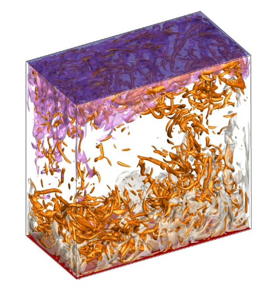
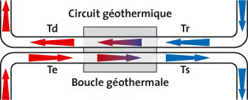
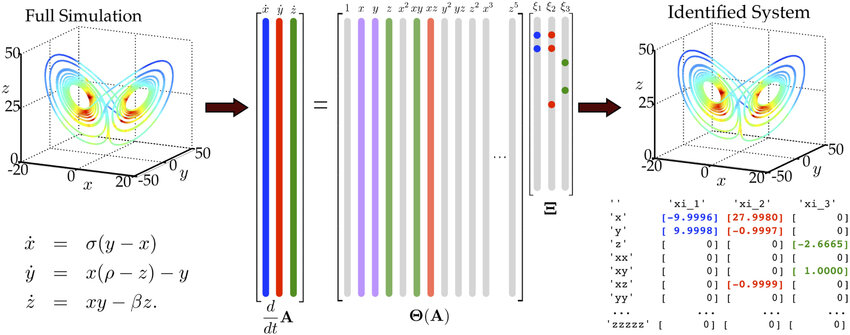
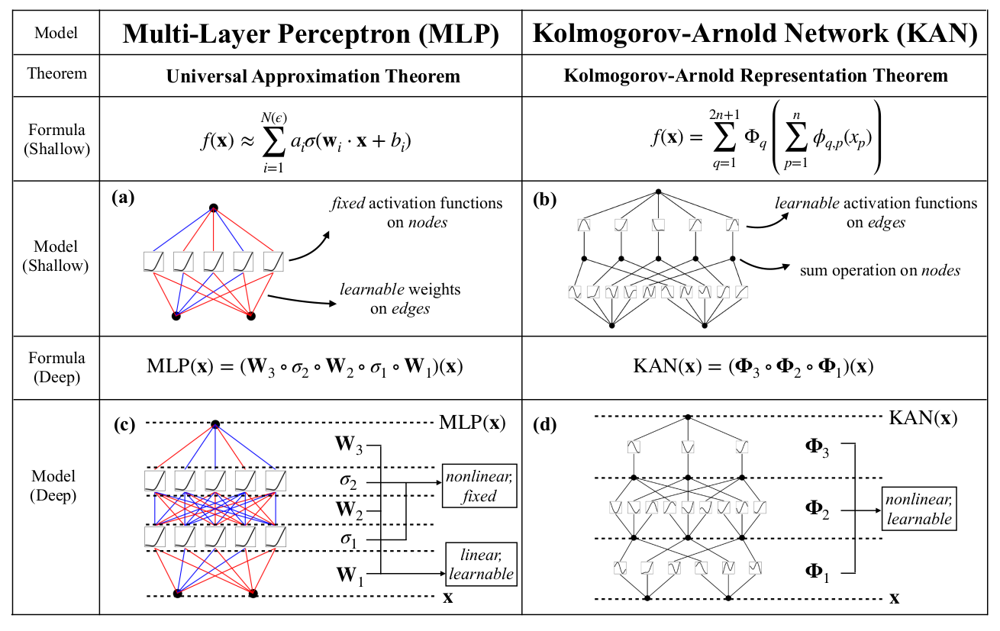

# Régression Symbolique Appliquée à la Convection Turbulente

[](https://www.python.org/)
[](https://pytorch.org/)

Ce projet applique la régression symbolique à la convection turbulente, spécifiquement la convection de Rayleigh-Bénard. L'étude utilise les modèles SINDy et KAN pour prédire des équations symboliques pour le cisaillement pariétal et le flux de chaleur à la paroi à partir de données de simulation DNS, effectuée par l'équipe COMET au Laboratoire Interdisciplinaire des Sciences du Numérique (LISN).

Cela s'inscrit dans une première étude, afin d'essayer et d'évaluer les méthodes sur ce type de données pour voir si elles sont prometteuses. Auquel cas, on pourra utiliser ce type d'outils numérique pour retrouver le cisaillement pariétal et le flux de chaleur à la paroi à partir de données expérimentales ou peu résolues. De nombreux domaines d'applications existent, comme l'aéronautique (pour évaluer le cisaillement sur la paroi des avions), la géothermie (évaluer le flux de chaleur entre deux fluides via une paroi), en biologie/médecine ([étude de l'écoulement sanguin](https://lejournal.cnrs.fr/articles/du-coeur-aux-poumons-lincroyable-mecanique-des-fluides-humains)).

## 📋 Table des Matières

- [Contexte](#contexte)
- [Problématique](#problematique)
- [Méthodologie](#méthodologie)
- [Résultats](#résultats)
- [Installation](#installation)
- [Utilisation](#utilisation)
- [Structure du Projet](#structure-du-projet)
- [Aspects Techniques](#aspects-techniques)
- [Contributions](#contributions)
- [Références](#références)

## 🔍 Contexte

### **Convection Turbulente de Rayleigh-Bénard**

Expérience fondamentale en mécanique des fluides pour l'étude des écoulements convectifs, la convection de Rayleigh-Bénard est illustrée ci-dessous. On a une paroi chaude en bas et une paroi froide en haut, puis sous l'effet de la poussée d'Archimède, la convection du fluide se produit.



Dans ce cadre, deux valeurs nous intéressent particulièrement : le **cisaillement pariétal** et le **flux de chaleur à la paroi**. 

### **Cisaillement Pariétal**


$$\tau = \mu \left. \dfrac{\partial u}{\partial z} \right|_{z=0}$$

C'est la perte de vitesse du fluide due aux frottements visqueux sur la paroi, avec $\mu$ la viscosité du fluide.

### **Flux de Chaleur**



$$q = - k \left. \dfrac{\partial \theta}{\partial z} \right|_{z=0}$$

C'est échange de chaleur entre la paroi et le fluide, avec $k$ la conductivité thermique de la paroi.

## ❓ Problématique 

Ces valeurs sont compliquées à déterminer par dérivation, car les données de simulation sont souvent de basse résolution surtout dans la couche visqueuse qui est très fine et proche de la paroi, expérimentalement les données très proche paroi sont inaccessible car les capteurs de mesure viennent perturber l'écoulement proche paroi. 

On va essayer de trouver des équations pour estimer ces valeurs sur des données de basse résolution ?

## 🧠 Méthodologie

**Données :** DNS de Rayleigh-Bénard ($\text{Ra} = 2 \cdot 10^9$) réalisée au LISN par l'équipe COMET.

**Modèles :** SINDy (pysindy) [1] et KAN (pykan) [2,3]

**Méthodologie :** Prédire une équation symbolique des champs de $\dfrac{\partial u}{\partial z}$ et $\dfrac{\partial \theta}{\partial z}$ sur un segment puis un plan vertical restreint.

### Sparse Identification of Nonlinear Dynamics (SINDy)

$$\dot{X} = \Psi(X) \Xi + \epsilon$$

- **Idée :** Quelques termes dominent les systèmes dynamiques
- Bibliothèque de fonctions non linéaires $\Psi(X)$ composée :
    - des données $u, w, \theta$ ;
    - des dérivées partielles en temps $\partial_t$ ; 
    - des dérivées partielles spatiales $\partial_x, \partial^2_x$ ;
    - des interactions entre $u, w, \theta$ et les dérivées partielles.




- Régression LASSO ($\ell_1$) pour la parcimonie :

$$\|\Xi\|_1 = \sum_{i} |\xi_i|$$

- Optimisation avec SR3 (ajout d'un terme de relaxation pour une convergence plus rapide) : 
$$\arg \min_{\Xi, W} \dfrac{1}{2}||\dot{X}-\Psi(X)\Xi||^2_2 + \lambda||W||_1 + \dfrac{\nu}{2}||W-\Xi||^2_2 $$

### Kolmogorov-Arnold Network (KAN)

- Alternative aux réseaux de neurones traditionnels (MLPs)




- Aussi bonnes, voir meilleures performances que les MLPs
- Plus interprétable que les MLPs :
  - Moins profond, moins large
  - Élagage des branches moins importantes (Pruning)


## 💥 Résultats

Voir les notebooks pour le détails. 

Synthèse : **A REMPLIR** 

## 💻 Installation

```bash
# Cloner le dépôt
git clone https://github.com/LylianChallier/SymboliConvection.git
cd SymboliConvection

# Créer et activer un environnement virtuel (optionnel)
conda create --name monenvironnement
conda activate monenvironnement

# Installer les dépendances
pip install -r requirements.txt
```

## 🚀 Utilisation

Exploration des méthodes directement via les notebooks.

Sur VSCode : 
```bash
# Ouvrir l'interface VSCode :
code .

# Ou directement : 
code derivee_spatiale.ipynb
```

Sur JupyterLab : 
```bash
# Ouvrir l'interface JupyterLab : 
jupyter lab .

# Ou directement : 
jupyter lab derivee_spatiale.ipynb
```

## 📁 Structure du Projet

```
SymboliConvection/
├── README.md
├── .gitignore
├── requirements.txt                        # Dépendances du projet
├── utils/
│   ├── data_processing.py                  # Module pour le traitement des données
│   ├── visualisation.py                    # Module pour la visualisation des données et des résultats
│   └── tools/
│       └── read_h5.py                      # Module pour la lecture des fichier de données en .h5
├── derivee_temporelle.ipynb                # Notebook pour le problème préliminaire (Annexe F)
├── derivee_spatiale.ipynb                  # Notebook pour l'estimation des dérivées spatiales (section 6.2)
└── couche_visqueuse.ipynb                  # Notebook pour les modèles experts de la couche visqueuse (section 6.3)
```

## 🤝 Contributions

Les contributions sont les bienvenues ! Pour contribuer:
1. Forkez le repository
2. Créez une branche pour votre fonctionnalité (`git checkout -b feature/nouvelle-fonctionnalite`)
3. Committez vos changements (`git commit -m 'Ajout d'une nouvelle fonctionnalité'`)
4. Poussez vers la branche (`git push origin feature/nouvelle-fonctionnalite`)
5. Ouvrez une Pull Request

## 📚 Références principales

- [[1] Brunton, S. L., Proctor, J. L., & Kutz, J. N. (2015). Discovering governing equations from data: Sparse identification of nonlinear dynamical systems (No. arXiv:1509.03580).](https://doi.org/10.48550/arXiv.1509.03580)
- [[2] Liu, Z., Wang, Y., Vaidya, S., Ruehle, F., Halverson, J., Soljačić, M., Hou, T. Y., & Tegmark, M. (2025). Kan: Kolmogorov-arnold networks (No. arXiv:2404.19756).](https://doi.org/10.48550/arXiv.2404.19756)
- [[3] Liu, Z., Ma, P., Wang, Y., Matusik, W., & Tegmark, M. (2024). Kan 2.0: Kolmogorov-arnold networks meet science (No. arXiv:2408.10205).](https://doi.org/10.48550/arXiv.2408.10205)